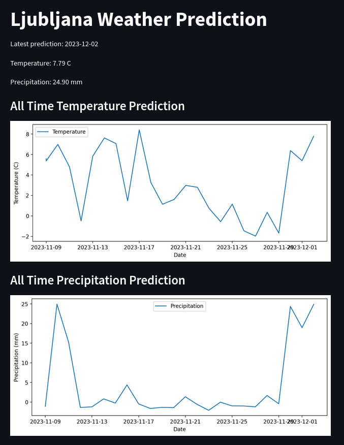

# Weather Prediction Streamlit Web App
Weather prediction model predictions Web App Fronend made with Streamlit (for a cloud computing uni course - RSO).

Its a simple app that shows the value of the latest prediction and a graph of the last month predictions.



## Running Locally

To run the application locally, follow these steps:

1. **Install Dependencies**:
   ```bash
   pip install -r requirements.txt
   ```

2. **Set Google Application Credentials**:
   ```bash
   export GOOGLE_APPLICATION_CREDENTIALS=/path/to/your/credentials.json
   ```

3. **Start Ray Serve Application**:
   ```bash
   streamlit run streamlit_predict.py
   ```

## Docker and GKE Deployment (TBD)